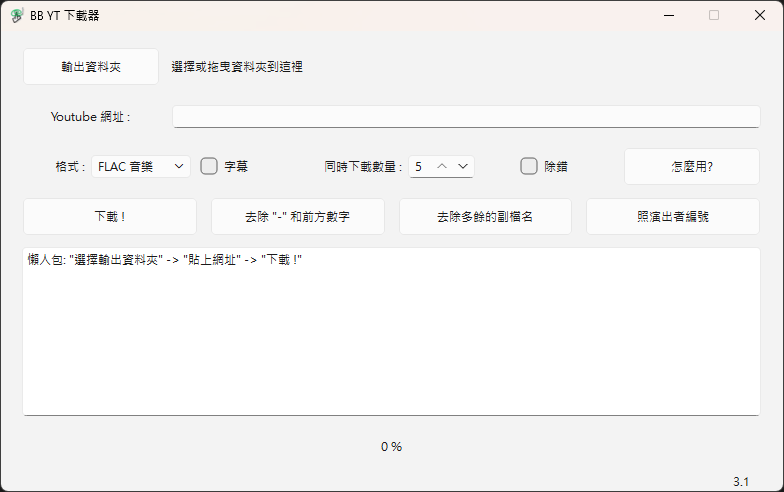

# BB YT 下載器
- 批次下載
- 影片
- 音樂
- 字幕
- yt-dlp + UI

### 截圖


# 下載
### 到 Releases 下載最新版

Windows:  
BB.YT.Downloader.exe  

Linux:  
BB.YT.Downloader  

# 使用
1. 選擇輸出資料夾
2. 貼上網址
3. 下載 !

# 想自己編譯?
## 需求
- [FFmpeg](https://ffmpeg.org/)
- [Deno](https://github.com/denoland/deno)

### 把 `deno`, `ffmpeg` 放在適當位置
```
bb-yt-downloader/
 ├─ deno/
 │   ├─ linux/
 │   │   └─ deno
 │   └─ windows/
 │       └─ deno.exe
 ├─ ffmpeg/
 │   ├─ linux/
 │   │   ├─ ffmpeg
 │   │   └─ ffprobe
 │   └─ windows/
 │       ├─ ffmpeg.exe
 │       └─ ffprobe.exe
 ├─ icon/
 │   ├─ bb-yt-downloader.ico
 │   └─ bb-yt-downloader.png
 ├─ bb-yt-downloader.py
 ├─ bb-yt-downloader.ui
 └─ requirements.txt
```

## Linux
```bash
chmod +x deno/linux/deno
chmod +x ffmpeg/linux/ffmpeg
chmod +x ffmpeg/linux/ffprobe
```

```bash
python3 -m venv .venv
source .venv/bin/activate
pip install -r requirements.txt
```

```bash
pyinstaller --noconfirm --onefile --windowed --icon=icon/bb-yt-downloader.png --name="BB YT Downloader" --add-data "icon:icon" --add-data "ffmpeg/linux:ffmpeg/linux" --add-data "deno/linux:deno/linux" --add-data "bb-yt-downloader.ui:." bb-yt-downloader.py
```

打包後會在 `./dist`  

## Windows
```bash
py -m venv .venv
.\.venv\Scripts\Activate.ps1
Set-ExecutionPolicy -ExecutionPolicy RemoteSigned -Scope Process -Force
pip install -r requirements.txt
```
```bash
pyinstaller --noconfirm --onefile --windowed --icon=icon/bb-yt-downloader.ico --name="BB YT Downloader" --add-data "icon;icon" --add-data "ffmpeg/windows;ffmpeg/windows" --add-data "deno/windows;deno/windows" --add-data "bb-yt-downloader.ui;." bb-yt-downloader.py
```

打包後會在 `./dist`  

# 版權
MIT License  

## 免責聲明
本工具僅供下載您擁有權利或已取得授權下載的內容.  
使用者須自行遵守所在地法律及各平台的使用條款.  